# Apna Cart

An E-commerce application built with CRUD functionality, and REST architechture.

> Deployed at  https://apna-cartv1.herokuapp.com/

### Tech Stack :-
- EJS
- Express
- NodeJs
- MongoDb

> ## Run Locally

<br>

***To run it locally on you machine you need to have a mongodb url,google auth key,razorpay key .If you have that , then clone/fork this repo and place all the key and mongo url in a .env file with respective key id as mentioned in the code***

### **.env file :** 
``` javascript
RZP_key_id="razorpay_key_id"
RZP_key_secret="razorpay_key_secret"
GA_clientID="your_google_auth_key_id"
GA_clientSecret='your_google_client_secret'
GA_callbackURL='google_call_back_url'
MDB_CONNECT='mongodb_database_link'
```

After that:-

- Open Terminal and write  >
``` bash
npm  install
```

- After installation completes  > 
``` bash
npm start
```
Navigate to localhost:3000 or the mentioned port .

> ## Features :
-  Both Local login and Google  sign in Authentication

- Razor Pay Payment Gateway Integration

- Uploading of File type Image as jpeg/png format.
<br>

> ## **Functionalities :**
<br>

> ### **Products** :

- Adding a new product 
- Editing an existing Product
- Delete an Existing Products

> ### **User** :
- Register a New User with or without a profile picture
- Login/LogOut as an user
- Review a product and edit or delete that review only
- Add a item to cart / view carts Page
- Place an Order and make payment with success / failure.
- View Orders placed by the user.

>### **Admin** :
- Access the Admin panel to get control over , Products, Orders and User.
- View, Update or Delete all products
- View all the Users Info along with Cart Information and Orders Information
- View all the order information placed throughout the website.


**The Admin Dashboard can only be accessed as an Admin user**

Default Admin Credentials : 
- username : admin
- password : admin123

# Screenshots

## Home page

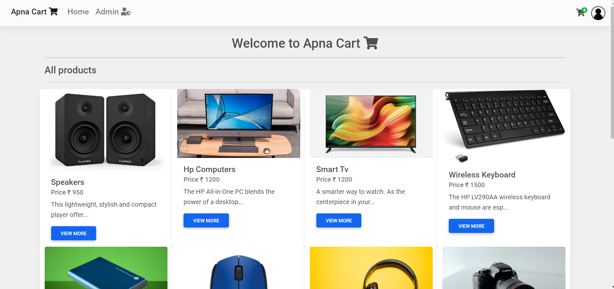 

## Item page
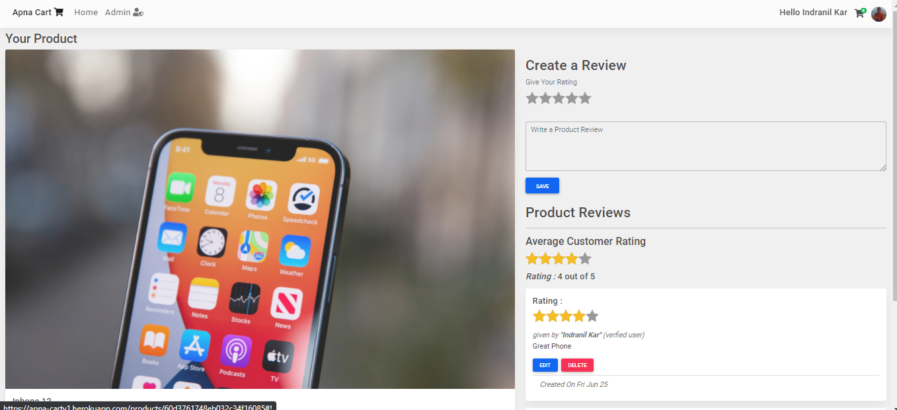

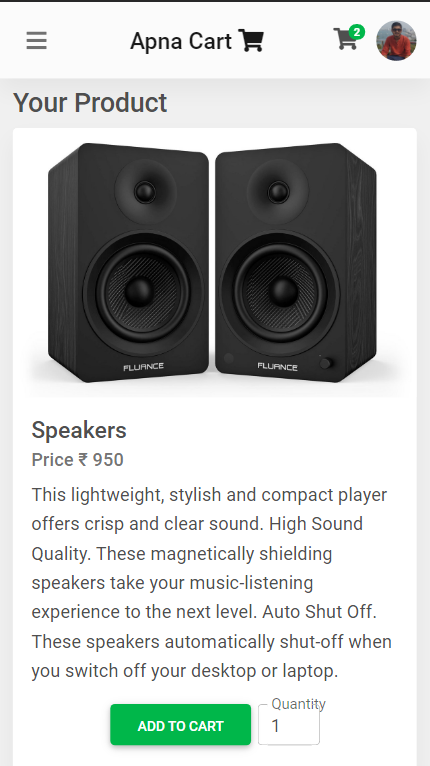

## Login page

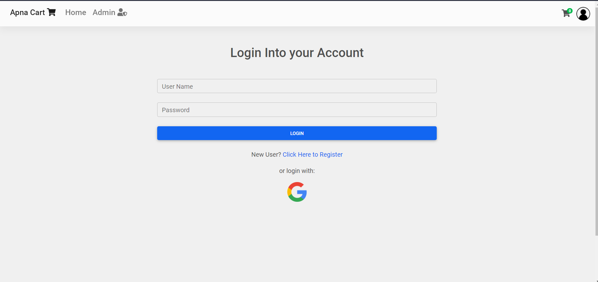

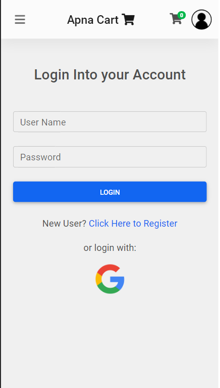
## Cart page
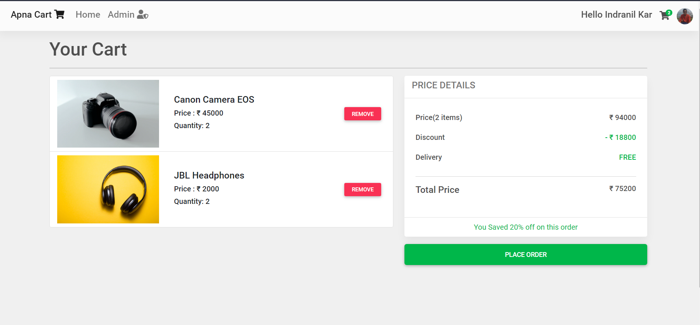

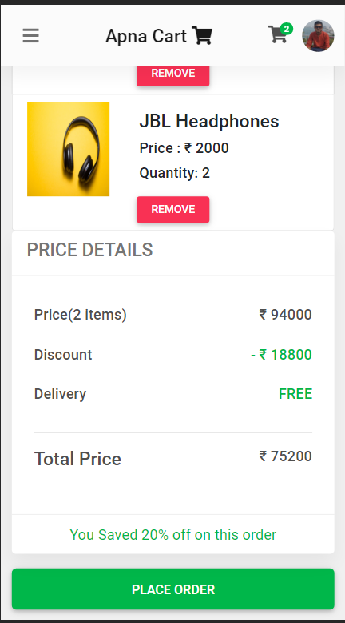

## Payment page 
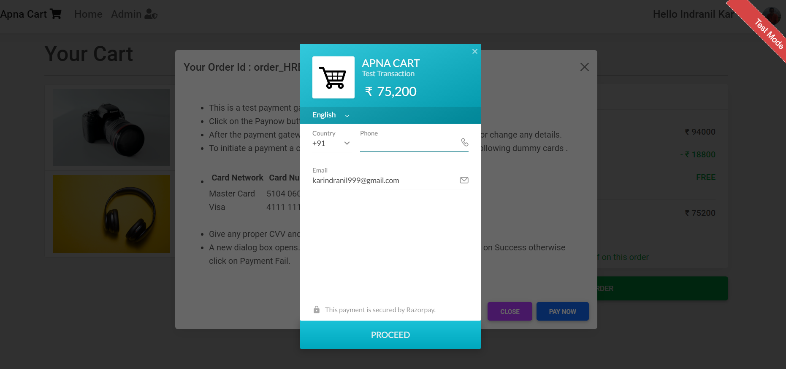

## Orders page 

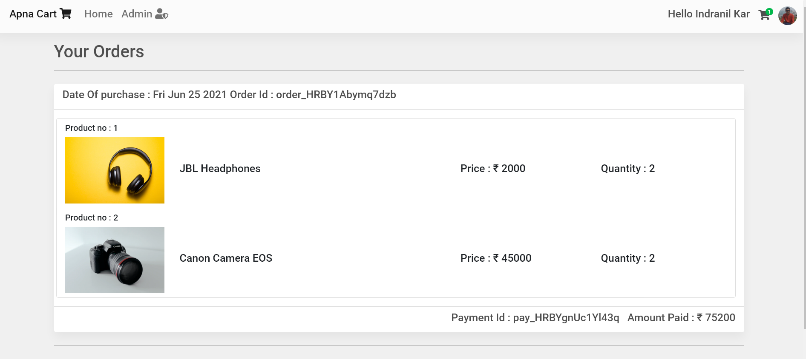

## Admin Dashboard

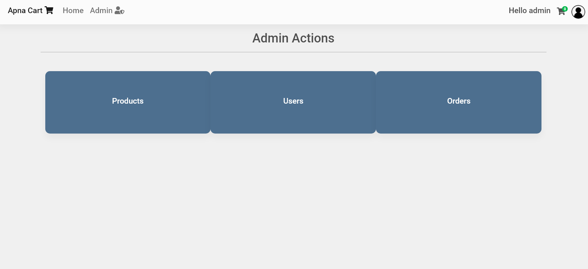

## User Dash board
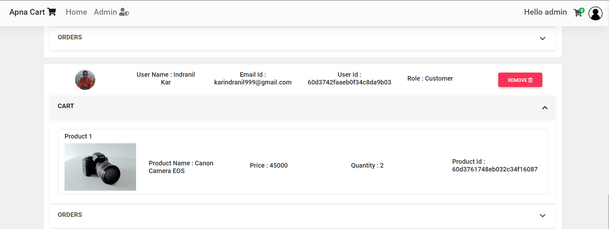

## Products Dash board
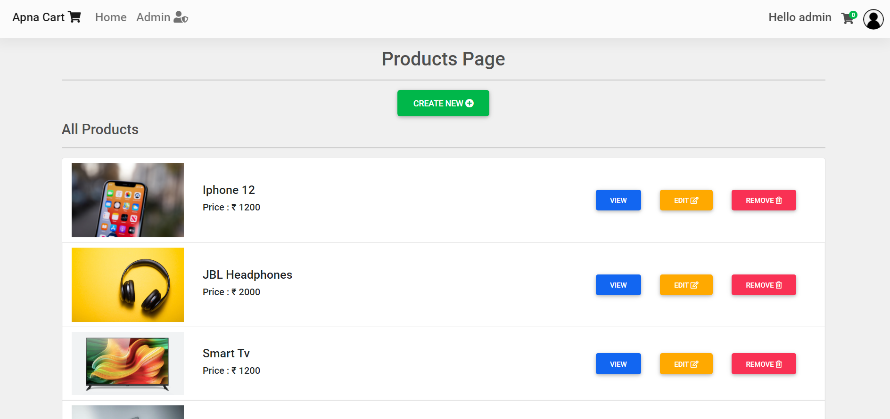

## Add a new Product


## Edit a Product

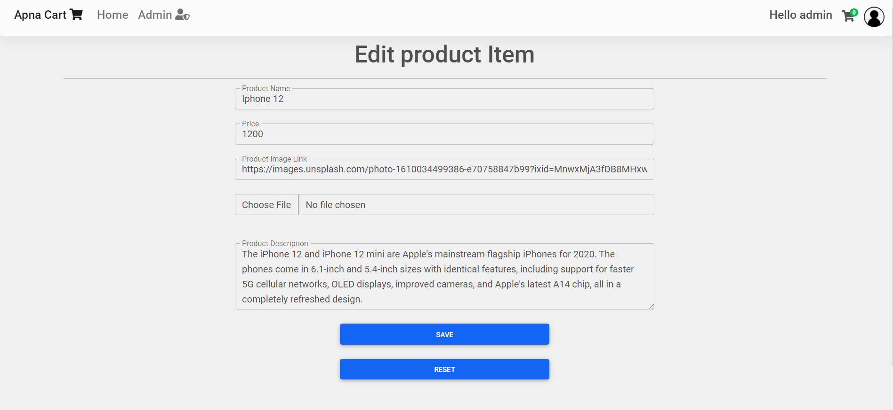
